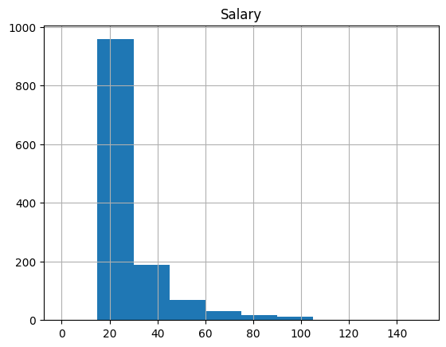

# **Data Analysis Report** - Yonghwan Choi

1. **What is the purpose of the analysis?**
   > Define the goal or objective of your analysis. Are you exploring patterns, relationships, outliers, or trying to gain insights into a specific aspect of the data?

- This analysis intends to find the relation between the wage of a job and the location of the workplace.
- The analysis includes remote jobs, which are known to have the least bonds to physical offices comparing to other jobs.
- This will help companies that need cost-efficient office areas that have relatively low wages. 

2. **What is the structure of the dataset?**
   > Understand the size of the dataset, the number of variables, and the types of variables (categorical, numerical, etc.).

- There are 4 columns (Title,Company,Location,Salary).
  - Title : string variable which is the job title itself.
  - Company : string variable which is the company that opened this job.
  - Location : string variable indicating the location of the job.
  - Salary : float variable indicating the hourly wage of the job.
- The dataset includes 1,278 rows of data, presenting all columns. Location and company data can be used for categorizing salary values (e.g. hourly wage by company, location, etc.)

3. **What are the key features or variables in the dataset?**
   > Identify the main variables that are relevant to your analysis.

- The most valuable and important variable of all is the salary data. This is the actual key value I want to predict, and the most precise and objective value to weigh a job. Company and Location are the values used for visualization & data clarification.

4. **Are there missing values in the dataset?**
   > Check for missing data and decide on a strategy for handling it (e.g., imputation, removal).

- I have error handling in the crawling code for removing incomplete data within the dataset. It removes the partial data so that data with full information will only be used.

  ```python
  import csv
  print(len(jobs))

  with open('jobs.csv', 'w') as f:
      writer = csv.writer(f)
      writer.writerow(['Title', 'Company', 'Location', 'Salary'])
      for job in jobs:
          try:
              writer.writerow([job.title, job.company, job.location, get_salary(job.salary)])
          except:
              pass
  ```

5. **What are the summary statistics of numerical variables?**
   > Calculate basic statistics such as mean, median, standard deviation, etc., to understand the central tendency and dispersion of numerical variables.

- The statistics for this dataset is as follows:

  - Mean: 27.360367762128327
  - Median: 21.5
  - Standard Deviation: 15.885060048807812
  - Minimum: 15.5
  - Maximum: 250.0

  These values were calculated with this code:

  ```python
  import pandas as pd

  # Load the CSV file
  df = pd.read_csv('jobs.csv')

  # Assuming 'Salary' is a column with numerical values
  # If 'Salary' contains non-numerical values or symbols, they should be cleaned or converted to numerical values first

  # Calculate statistics
  mean_salary = df['Salary'].mean()
  median_salary = df['Salary'].median()
  std_dev_salary = df['Salary'].std()
  min_salary = df['Salary'].min()
  max_salary = df['Salary'].max()

  # Display the results
  print("Salary Statistics:")
  print(f"Mean: {mean_salary}")
  print(f"Median: {median_salary}")
  print(f"Standard Deviation: {std_dev_salary}")
  print(f"Minimum: {min_salary}")
  print(f"Maximum: {max_salary}")

  ```

6. **How are categorical variables distributed?**

   > Examine the distribution of categorical variables through frequency tables or visualizations.

   - For the 
     

7. **Are there any outliers in the data?**

   > Identify and assess the presence of outliers in numerical variables.

   - According to the Z-score method for catching outlier data, there were 10+ rows that are significantly different compared to other values.

   ```csv
   ,Title,Company,Location,Salary,Z_Score
   3,Freelance - Game Tester - Novato,Good Gamer Group,"Good Gamer Group in Novato, CA 94945",100.0,4.574617153783892
   116,Team Assistant,Anthropic,"San Francisco, CA",85.94,3.689162269161447
   133,Fundamental Research Associate (Equities),Capital Group Companies,"San Francisco, CA",93.56,4.169046068650994
   202,Director of Influencer,Fabletics,"El Segundo, CA 90245",82.03,3.44292268175933
   209,Weight Management Provider,Dion Health,,250.0,14.0211486397986
   224,"Vans: Director, FPA Global Brands",Vans,"Costa Mesa, CA 92626",92.81,4.12181341122092
   279,County Clerk/Recorder,"Sacramento County, CA","Sacramento, CA",101.21,4.6508191744377445
   298,Executive Assistant,TextNow,"San Mateo, CA",83.33,3.524792621304791
   317,Registrar of Voters,San Bernardino County,"San Bernardino, CA",96.75,4.36994230492024
   334,"Manager, Business Human Resources",ABBVIE,"Irvine, CA",95.83,4.312003578472684
   336,"Director, Disability Inclusion",Workday,"6110 Stoneridge Mall Rd, Pleasanton, CA",129.22,6.414801487259557
   412,React Native,Zorang Technologies,"California City, CA",85.53,3.66334174976634
   429,Director of Food Services,Stanford Health Care,"Palo Alto, CA 94305",92.01,4.071431909962176
   436,ROTA Nanny,Prosperity Nannies & Lifestyle Management,"Prosperity Nannies & Lifestyle Management in Beverly Hills, CA 90211",75.52,3.0329432152662914
   453,Assistant Superintendent,Holder Construction,"San Jose, CA",80.73,3.3610527422138694
   464,Business Analyst,BayOne,"Santa Clara, CA",81.0,3.3780564988886956
   465,Heavy Equipment Operator,Shadd Williams,"Orange County, CA",83.0,3.5040102520355587
   582,ASSISTANT STORE DIRECTOR - RODEO DRIVE,Louis Vuitton,"295 North Rodeo Drive, Beverly Hills, CA",80.73,3.3610527422138694
   593,Estate Manager,Best Employment Corp,"Westwood, CA",97.66,4.427251262602062
   645,Director of Manufacturing,K-1 Packaging Group,"17989 Arenth Avenue, Industry, CA 91748",91.15,4.017271796109025
   653,Estate Manager,"Excellence Services, LLC","Atherton, CA",75.78,3.049317203175384
   655,Estate Manager,"Excellence Services, LLC","Atherton, CA",75.78,3.049317203175384
   658,"Assistant Head for Diversity, Equity, and Inclusion",San Domenico School,"1500 Butterfield Road, San Anselmo, CA 94960",84.64,3.6072923296159862
   663,Sales Manager,Uline,"San Jose, CA",80.73,3.3610527422138694
   700,Program Manager,Digital Force Technologies,"6779 Mesa Ridge Road, San Diego, CA 92121",82.03,3.44292268175933
   720,Growth Marketing Director,Wonder Sciences,"4011 Ocean Front Walk, Marina del Rey, CA 90292",83.33,3.524792621304791
   722,Plumbing Service Tech,Classet,"Simi Valley, CA 93065",91.15,4.017271796109025
   725,Growth Marketing Director,Wonder Sciences,"4011 Ocean Front Walk, Marina del Rey, CA 90292",83.33,3.524792621304791
   727,Plumbing Service Tech,Classet,"Simi Valley, CA 93065",91.15,4.017271796109025
   758,General Manager at Los Lagos Golf Course (with Multi-course Oversight),"CourseCo, Inc","2995 Tuers Road, San Jose, CA 95121",78.12,3.1966830943572138

   ```

8. **What is the distribution of the target variable (if applicable)?**

   > If you have a target variable (e.g., in a predictive modeling scenario), understand its distribution.
   - 

9. **Are there any patterns or trends over time?**

   > If time is a factor, explore whether there are any temporal patterns or trends.
   - Time is not a factor

10. **Are there correlations between variables?**

    > Use correlation matrices or scatter plots to investigate relationships between numerical variables.
   - 

11. **How does the data vary across different groups or categories?**

    > Compare subsets of the data to understand variations across different groups or categories.

12. **What visualizations can help in understanding the data better?**

    > Consider using visualizations like histograms, box plots, scatter plots, etc., to gain insights.

13. **What preprocessing steps might be necessary for further analysis?**

    > Identify any preprocessing steps needed, such as scaling, encoding categorical variables, or handling outliers.

14. **Are there any unusual patterns or unexpected findings?**

    > Look for patterns that are unexpected or may require further investigation.

15. **What are the limitations of the dataset?**
    > Recognize any limitations or potential biases in the data that may impact your analysis.
