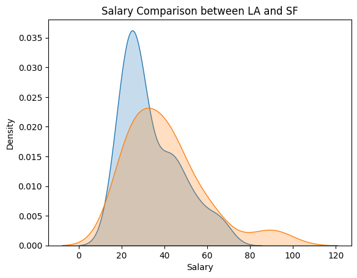
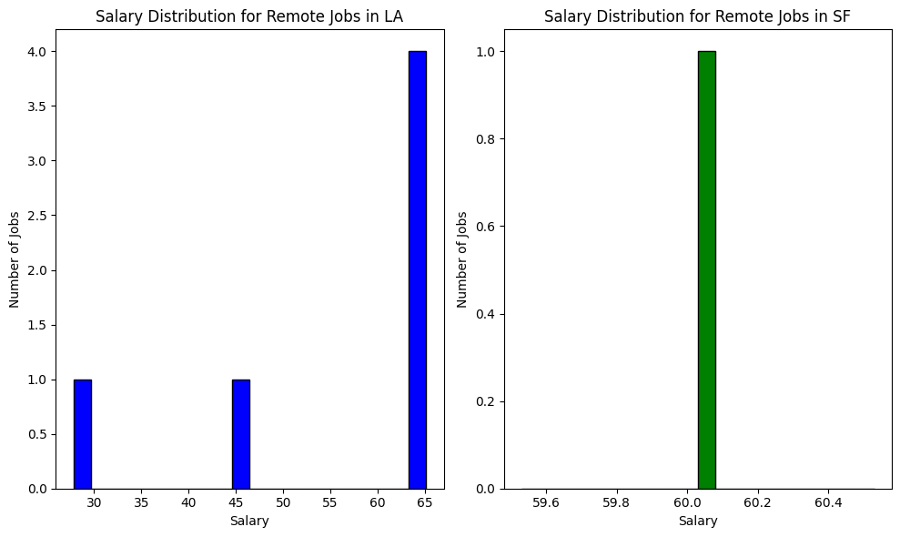
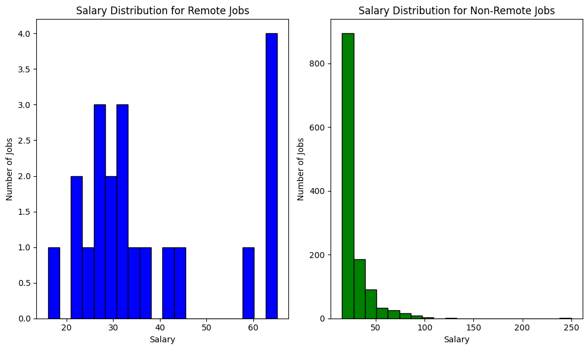
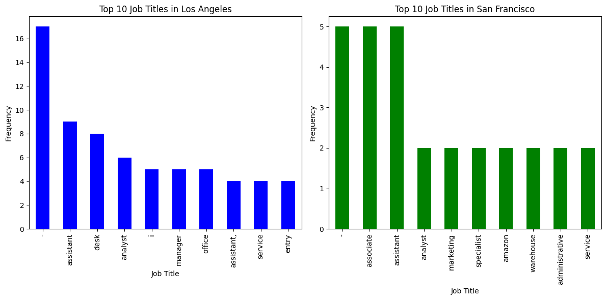

# **Data Analysis Report** - Yonghwan Choi

## Introduction

- This analysis intends to find the relation between the wage of a job and the location of the workplace.
- The analysis includes remote jobs, which are known to have the least bonds to physical offices comparing to other jobs.
- This will help companies that need cost-efficient office areas that have relatively low wages.

So the main questions of this analysis is:

- Do LA-located jobs have a higher wage than SF-located jobs?
- How does the wage differ for remote jobs and non-remote jobs?
- What are the job titles that show often in LA and SF?

## Data Description

- There are 4 columns (Title,Company,Location,Salary).
  - Title : string variable which is the job title itself.
  - Company : string variable which is the company that opened this job.
  - Location : string variable indicating the location of the job.
  - Salary : float variable indicating the hourly wage of the job.
- The dataset includes 1,278 rows of data, presenting all columns. Location and company data can be used for categorizing salary values (e.g. hourly wage by company, location, etc.)

## Methodology

### Data Crawling

Selenium was used for the crawling process, helping the fetching process of dynamic pages.
Crawled jobs are temporarily recorded in the local program memory as a Job Class using python.

```python
# Class to represent a job

class Job:

    title: str
    company: str
    location: str
    salary: str
    job_type: str

    def __init__(self, title, company, location, salary, job_type):
        self.title = title
        self.company = company
        self.location = location
        self.salary = salary
        self.job_type = job_type

    def __str__(self):
        return f"{self.title} | {self.company} | {self.location} | {self.salary}"
```

The goal was to gather 3,000 records of jobs located in California from Indeed.com. The 4 columns that were scraped are the values that were essential for a Indeed job enlistment except the salary value.

There is also error handling in the code which removes insufficient data, which are missing one or more of the 4 columns. This occurs often due to network issues during the crawling session, or mostly missing the salary value which many companies chose to hide.

According to the Z-score method, there were 10+ rows that are significantly outlying compared to other values.

```csv
,Title,Company,Location,Salary,Z_Score
3,Freelance - Game Tester - Novato,Good Gamer Group,"Good Gamer Group in Novato, CA 94945",100.0,4.574617153783892
116,Team Assistant,Anthropic,"San Francisco, CA",85.94,3.689162269161447
133,Fundamental Research Associate (Equities),Capital Group Companies,"San Francisco, CA",93.56,4.169046068650994
202,Director of Influencer,Fabletics,"El Segundo, CA 90245",82.03,3.44292268175933
209,Weight Management Provider,Dion Health,,250.0,14.0211486397986
224,"Vans: Director, FPA Global Brands",Vans,"Costa Mesa, CA 92626",92.81,4.12181341122092
279,County Clerk/Recorder,"Sacramento County, CA","Sacramento, CA",101.21,4.6508191744377445
298,Executive Assistant,TextNow,"San Mateo, CA",83.33,3.524792621304791
317,Registrar of Voters,San Bernardino County,"San Bernardino, CA",96.75,4.36994230492024
334,"Manager, Business Human Resources",ABBVIE,"Irvine, CA",95.83,4.312003578472684
336,"Director, Disability Inclusion",Workday,"6110 Stoneridge Mall Rd, Pleasanton, CA",129.22,6.414801487259557
412,React Native,Zorang Technologies,"California City, CA",85.53,3.66334174976634
429,Director of Food Services,Stanford Health Care,"Palo Alto, CA 94305",92.01,4.071431909962176
436,ROTA Nanny,Prosperity Nannies & Lifestyle Management,"Prosperity Nannies & Lifestyle Management in Beverly Hills, CA 90211",75.52,3.0329432152662914
453,Assistant Superintendent,Holder Construction,"San Jose, CA",80.73,3.3610527422138694
464,Business Analyst,BayOne,"Santa Clara, CA",81.0,3.3780564988886956
465,Heavy Equipment Operator,Shadd Williams,"Orange County, CA",83.0,3.5040102520355587
582,ASSISTANT STORE DIRECTOR - RODEO DRIVE,Louis Vuitton,"295 North Rodeo Drive, Beverly Hills, CA",80.73,3.3610527422138694
593,Estate Manager,Best Employment Corp,"Westwood, CA",97.66,4.427251262602062
645,Director of Manufacturing,K-1 Packaging Group,"17989 Arenth Avenue, Industry, CA 91748",91.15,4.017271796109025
653,Estate Manager,"Excellence Services, LLC","Atherton, CA",75.78,3.049317203175384
655,Estate Manager,"Excellence Services, LLC","Atherton, CA",75.78,3.049317203175384
658,"Assistant Head for Diversity, Equity, and Inclusion",San Domenico School,"1500 Butterfield Road, San Anselmo, CA 94960",84.64,3.6072923296159862
663,Sales Manager,Uline,"San Jose, CA",80.73,3.3610527422138694
700,Program Manager,Digital Force Technologies,"6779 Mesa Ridge Road, San Diego, CA 92121",82.03,3.44292268175933
720,Growth Marketing Director,Wonder Sciences,"4011 Ocean Front Walk, Marina del Rey, CA 90292",83.33,3.524792621304791
722,Plumbing Service Tech,Classet,"Simi Valley, CA 93065",91.15,4.017271796109025
725,Growth Marketing Director,Wonder Sciences,"4011 Ocean Front Walk, Marina del Rey, CA 90292",83.33,3.524792621304791
727,Plumbing Service Tech,Classet,"Simi Valley, CA 93065",91.15,4.017271796109025
758,General Manager at Los Lagos Golf Course (with Multi-course Oversight),"CourseCo, Inc","2995 Tuers Road, San Jose, CA 95121",78.12,3.1966830943572138

```

### Data Visualization

Plots for data visualization are mostly created with matplotlib, with word clouds using wordcloud package in python.

## Analysis

Before beginning, basic statistics for this dataset is:

- Mean: 27.360367762128327
- Median: 21.5
- Standard Deviation: 15.885060048807812
- Minimum: 15.5
- Maximum: 250.0


Most of the jobs gather at the 20~30$ per hour wage point, showing that most of the job openings listed in Indeed.com are low wage part-time jobs.

- **Do LA-located jobs have a higher wage than SF-located jobs?**

  

  > Blue is LA, Orange is SF.

  from this graph, LA seems to have a bigger amount of jobs that provide 20~30$ wage per hour, while SF has more jobs that have the high-end income jobs. Since 100$ per hour is 4K per week (40hrs/week), we can say that these jobs are close to 200K/yr jobs, which are way above the average american salary.

  
  There were very few data for remote jobs in LA and SF.

- **How does the wage differ for remote jobs and non-remote jobs?**

  

  > This plot finds remote jobs by finding "remote" keywords inside the job title. Therefore the number of non-remote jobs outstand the remote jobs with a big gap.

  Remote jobs advertised in Indeed.com appear to have a wide spread comparing to the non-remote jobs, which are mostly concentrated to the 10~100$ per hour portion. This mostly is due to the part-time clerk, waitress jobs that are mandatorily non-remote jobs, and mostly have a relatively low wage comparing to high-value industry jobs like software engineers, bio-tech researchers, etc.

- **What are the job titles that show often in LA and SF?**

  
  Ignoring the meaningless data, assistant, entry jobs are found in both LA and SF, showing that there are a lot of job openings for people in the early stage of their career.

  

  this word cloud shows the frequency of the words included in the job title of each locations. By the size of words, we can tell that LA has more remote jobs, but other titles do not tend to show meaningful differences between the two metropolitans.

## Results

This analysis shows that San Francisco has more high-income jobs compared to LA. Although the dataset was small that remote jobs in the two cities were not enough to make it into a statistic, there were some similar parts of the two cities indicating that the job market in the US is not very different by each city.

And the pattern that I didn't expect on this analysis was that remote jobs aren't showing up a lot in downtown areas. This might be due to the popularity of remote jobs, so that future employees rush for the jobs so they aren't left in Indeed.com, or maybe downtown areas are already a popular commute area, so only offices outside of downtown try to get more remote workers.

## Feedback from myself

The dataset had some faults to use it for this purpose, due to its lack of numeral data except the salary value. If there were the distance to the closest metropolitan, it would have been possible to retrieve more meaningful results and useful plots.
